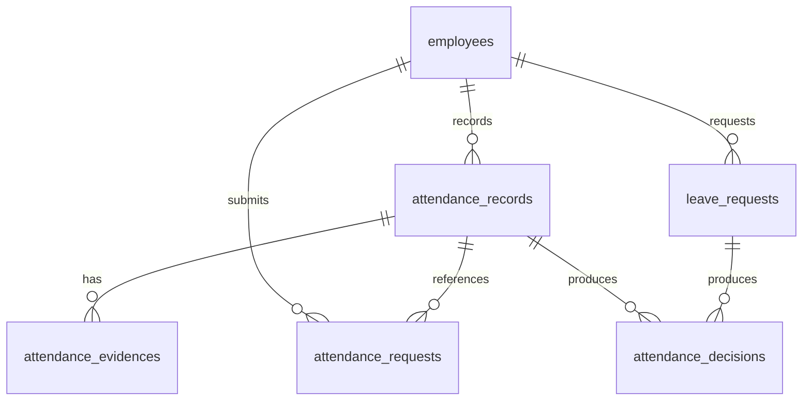

# Extended ERD – Mobile Attendance (V1)

## Purpose
This document defines the **Mobile Attendance ERD** that feeds the payroll system.

Scope:
- Clock in / clock out from mobile
- Late & correction requests
- Leave requests
- Supervisor approval

Non-goal:
- Payroll calculation
- Salary mutation

Attendance **produces claims and facts**, not money.

---

## Core Principle

> **Mobile submits claims.  
> HR validates facts.  
> Payroll consumes decisions.**

Attendance data must be:
- Append-only
- Auditable
- Explainable in disputes

---

## Conceptual Flow

```
Mobile App
→ Attendance Records (raw)
→ Requests (late / correction / leave)
→ Approval
→ Attendance Decisions
→ Payroll
```

---

## Tables

### 1. Attendance Records (Raw Input)

```
attendance_records
- id
- employee_id
- work_date
- clock_in_at
- clock_out_at
- source            -- mobile, machine, import
- status            -- PENDING, APPROVED, REJECTED, LOCKED
- created_at
```

Rules:
- One logical record per employee per date
- Never silently overwritten
- Locked when payroll starts

---

### 2. Attendance Evidence (Optional Proof)

```
attendance_evidences
- id
- attendance_record_id
- type              -- GEOLOCATION, DEVICE, PHOTO
- payload            -- JSON (lat/lng, device id, image ref)
- captured_at
```

Rules:
- Optional
- Expandable
- Never required for payroll logic

---

### 3. Attendance Requests (Late / Correction)

```
attendance_requests
- id
- employee_id
- attendance_record_id   -- nullable
- request_type           -- LATE, CORRECTION, MISSING
- requested_clock_in_at
- requested_clock_out_at
- reason
- status                 -- PENDING, APPROVED, REJECTED
- requested_at
```

Rules:
- Does not mutate attendance directly
- Approval may create a new attendance record

---

### 4. Leave Requests

```
leave_requests
- id
- employee_id
- leave_type        -- PAID, UNPAID, SICK_PAID, SICK_UNPAID
- start_date
- end_date
- total_days
- reason
- status            -- PENDING, APPROVED, REJECTED
- approved_by
```

Rules:
- Approved before payroll
- Converted into attendance decisions

---

### 5. Attendance Decisions (Payroll Boundary)

```
attendance_decisions
- id
- employee_id
- source_type       -- ATTENDANCE, LEAVE
- source_id
- decision_type     -- PRESENT, LATE, ABSENT, PAID_LEAVE, UNPAID_LEAVE
- decision_date
- reason
- decided_at
```

Rules:
- This is the **only attendance table payroll reads**
- Immutable once payroll is finalized

---

## ERD Diagram (Mermaid)



---

## What This Enables

- Mobile-first attendance without payroll risk
- Supervisor approval workflows
- Legal-grade attendance history
- Clean boundary between facts and money

---

## Explicit Non-Goals (V1)

- Auto salary deduction from attendance
- Geo-fence enforcement logic
- Biometric validation

These can be added later without schema rewrite.

---

## Final Rule

> **Attendance answers: did they show up?  
> Payroll answers: how much do we pay?**

Never mix them.

