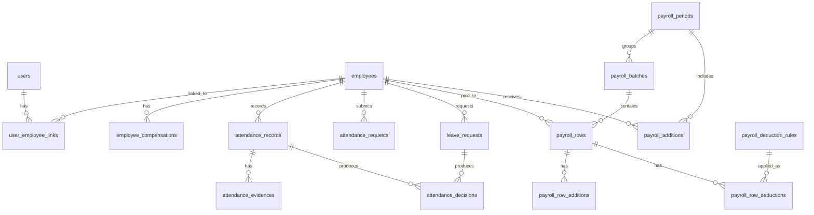

# Extended ERD – Payroll Deductions & Additions (V1)

## Purpose
This document extends the **V1 Payroll + Attendance ERD** to support:
- Statutory deductions (BPJS Kesehatan, BPJS Ketenagakerjaan)
- Payroll additions (THR, bonus, variable allowance)

The goal is **auditability, immutability, and decision traceability**, not convenience calculations.

---

## Core Principle (Non‑Negotiable)

> **If money moves, there must be a record explaining why.**

No implicit calculation.
No hidden fields on employee.
No retroactive mutation.

---

## Conceptual Placement

```
Employment Terms
→ Payroll Rules (Deductions)
→ Payroll Inputs (Additions)
→ Payroll Decision
→ Payroll Result (Frozen)
```

- Deductions are **rule‑based**
- Additions are **explicit inputs**
- Payroll rows are **historical facts**

---

## New Tables

### 1. Payroll Deduction Rules
Defines how statutory or company deductions are calculated.

```
payroll_deduction_rules
- id
- company_id
- code                -- BPJS_KES, BPJS_TK_JHT, etc
- name
- basis_type          -- BASE_SALARY, CAPPED_SALARY
- employee_rate       -- percentage
- employer_rate       -- percentage
- salary_cap          -- nullable
- effective_from
- effective_to
```

Rules:
- Append‑only
- Effective‑dated
- Never modified retroactively

---

### 2. Payroll Additions
Explicit income added for a specific payroll period.

```
payroll_additions
- id
- employee_id
- payroll_period_id
- code                -- THR, BONUS, INCENTIVE
- amount
- description
- created_by
- created_at
```

Rules:
- Period‑bound
- Owner‑visible
- Not inferred from attendance

---

### 3. Payroll Row Deductions (Snapshot)
Frozen result of deduction calculation during payroll.

```
payroll_row_deductions
- id
- payroll_row_id
- deduction_code
- employee_amount
- employer_amount
- rule_snapshot       -- JSON
```

Rules:
- Written once
- Never recalculated

---

### 4. Payroll Row Additions (Snapshot)
Frozen result of additions applied to payroll.

```
payroll_row_additions
- id
- payroll_row_id
- addition_code
- amount
- source_reference    -- payroll_additions.id
```

Rules:
- Traceable
- Immutable after payroll finalization

---

## Extended ERD (Mermaid)



---

## What This Design Guarantees

- BPJS rule changes never affect past payrolls
- THR and bonus are always intentional and auditable
- Payroll exports are explainable line‑by‑line
- Owners can defend payroll decisions legally and financially

---

## Explicit Non‑Goals (V1)

- Full tax engine
- Automatic bonus inference
- Retroactive payroll mutation

These belong to V2+ only.

---

## Final Rule

> **Attendance produces facts.  
> Rules produce calculations.  
> Payroll records truth.**

If any feature violates this, it does not ship.

