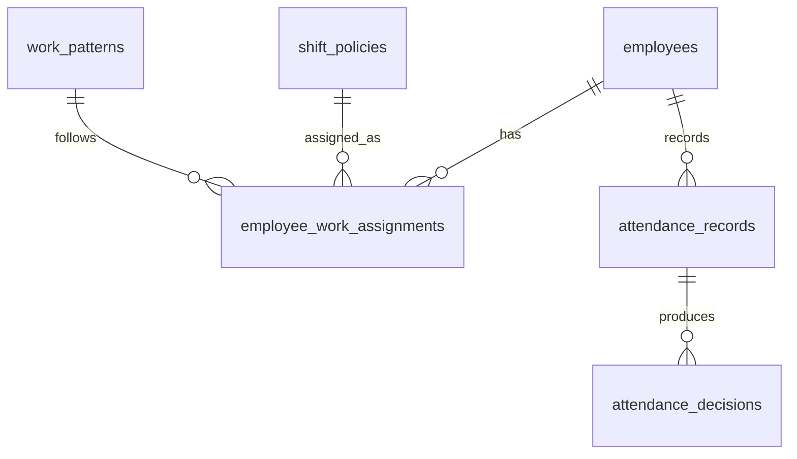

# Extended ERD – Shift Policy & Work Pattern (V1)

## Purpose
This document extends the **V1 Attendance + Payroll ERD** to support:
- 5-day, 6-day, or all-days work schemes
- Different daily working hours (7h / 8h / 9h)
- Late tolerance rules

Without introducing:
- Scheduling engines
- Daily rosters
- Rotating shifts

This is **payroll-grade**, not workforce-management bloat.

---

## Core Principle

> **Time rules explain hours.  
> Day rules explain obligation.  
> Payroll judges money.**

Shift ≠ Schedule

---

## Conceptual Separation

```
Shift Policy   → defines time expectations
Work Pattern   → defines working days
Employee       → binds both (effective-dated)
Attendance     → records timestamps
Payroll        → consumes decisions
```

---

## Tables

### 1. Shift Policies (Time-Based Rules)

```
shift_policies
- id
- company_id
- name
- start_time              -- 09:00
- end_time                -- 17:00
- late_after_minutes      -- 15
- minimum_work_hours      -- 7 / 8 / 9
- created_at
```

Rules:
- No per-date logic
- Used only for interpretation
- Append-only (new row = rule change)

---

### 2. Work Patterns (Day-Based Rules)

```
work_patterns
- id
- company_id
- name                    -- 5_DAY, 6_DAY, ALL_DAYS
- working_days             -- JSON or bitmask (Mon–Sun)
- created_at
```

Examples:
- 5_DAY → Mon–Fri
- 6_DAY → Mon–Sat
- ALL_DAYS → Mon–Sun

Rules:
- Explicit days only
- No assumptions about weekends

---

### 3. Employee Work Assignments

```
employee_work_assignments
- employee_id
- shift_policy_id
- work_pattern_id
- effective_from
- effective_to
```

Rules:
- Effective-dated
- One active assignment per employee
- Historical assignments preserved

---

## ERD Diagram (Mermaid)



---

## How Payroll Uses This

For each employee and work date:
1. Resolve active `employee_work_assignment`
2. Check if date ∈ `work_patterns.working_days`
3. Compare attendance vs `shift_policies`
4. Produce `attendance_decision`

Payroll **never** reads raw shift or pattern directly — only decisions.

---

## Explicit Non-Goals (V1)

- Rotating schedules
- Daily overrides
- Shift swaps
- Calendar UI

Those belong to workforce management, not payroll foundation.

---

## Why This Design Survives Reality

- Supports all common Indonesian SME patterns
- Explains every late / absent decision
- Allows future expansion without schema rewrite
- Keeps mobile app simple

---

## Final Rule

> **If a day is payable, it must be explicitly defined as a workday.**

No inference. No magic.

